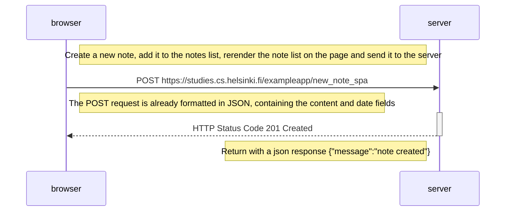

```mermaid
sequenceDiagram
    participant browser
    participant server

    Note right of browser: Create a new note, add it to the notes list, rerender the note list on the page and send it to the server

    browser->>server: POST https://studies.cs.helsinki.fi/exampleapp/new_note_spa

    Note right of browser: The POST request is already formatted in JSON, containing the content and date fields
    
    activate server
    server-->>browser: HTTP Status Code 201 Created
    deactivate server

    Note left of server: Return with a json response {"message":"note created"}
```